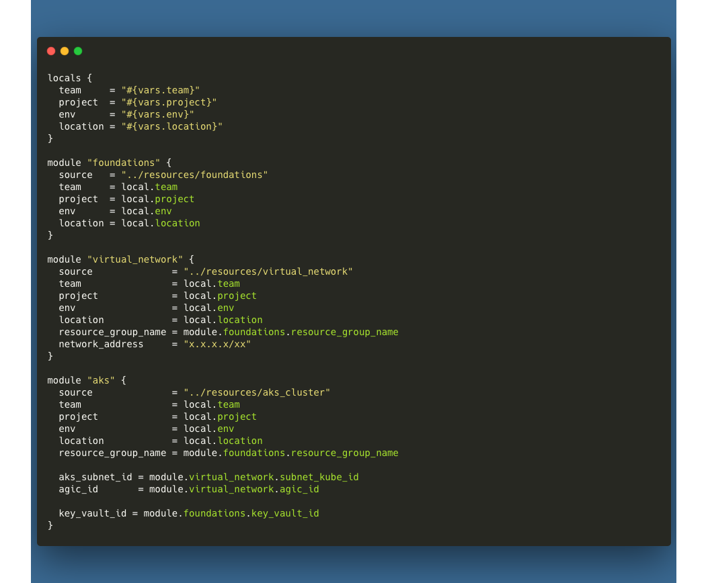

# Azure Kubernetes Service Cluster

Azure Kubernetes Service (AKS) is a managed Kubernetes service that allows you to deploy, manage, and scale containerized applications using Kubernetes. This implementation focuses on a single cluster setup, which is perfect for applications that require a high level of control over the underlying infrastructure, with multiple microservice workloads to manage.

AKS clusters require several prerequisites to be met before they can be deployed. These prerequisites include advanced networking elements, such as virtual networks and subnets, as well as a container registry and ingress gateway.

This implementation assumes that the networking prerequisites have been created in accordance with other templates that are present elsewhere in this project. We will also utilize an App Gateway Ingress Controller (AGIC) to manage traffic ingress to the cluster. The AGIC is already configured in the App Gateway template, so no additional setup is required.

## File Structure
AKS cluster templates are located in the `templates/aks_cluster` directory. The `main.tf` file contains the AKS cluster resource definition. The `_var.tf` file contains the input variables for the resource. The `_output.tf` file contains the output variables for the resource. The `vault.tf` file contains resources and data objects that tie into your Key Vault implementation for secure storage and retrieval of cluster credentials, as well as the generation of SSH keys for cluster access.

`providers.tf` is a special file that contains the provider configuration for the `azapi` provider. This provider is used to interact with the Azure API to create and manage resources in your Azure subscription that are not available for use in the `azurerm` provider. Inclusion of this file is mandatory to avoid errors when running Terraform commands.

```
- templates
  - aks_cluster
    - main.tf
    - _var.tf
    - _output.tf
    - vault.tf
    - providers.tf
```

## Usage
Example usage of this module can be found in the `templates/implementation` directory. At a minimum, you will need to implement the following local and module declarations in your environment definition file:

