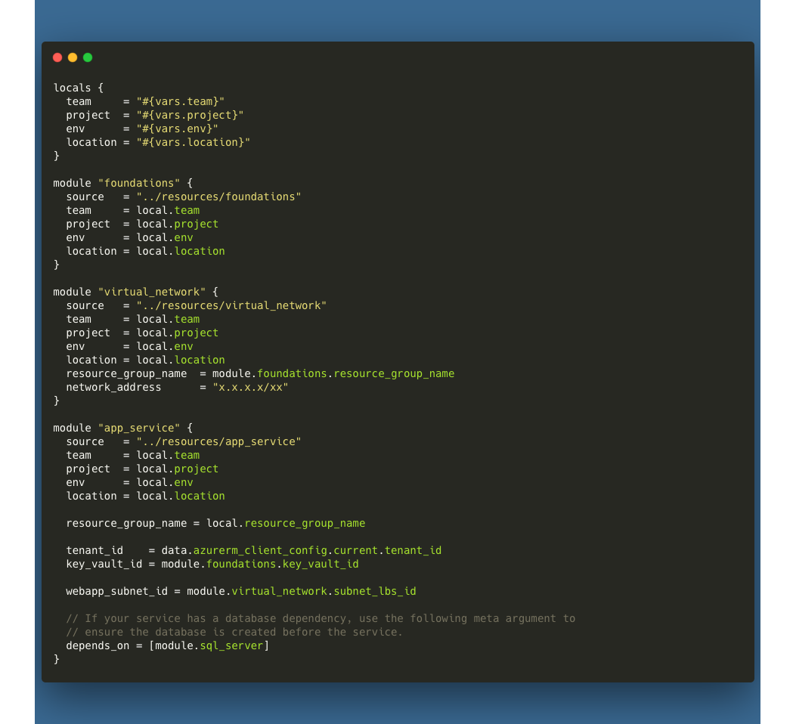

# App Services

Azure App Service is a fully managed platform for building, deploying, and scaling web apps. This implementation focuses on monolithic container setups, which is perfect for a single application with no internal dependencies.

App Services are a great way to deploy a web application quickly and easily. They are fully managed, meaning that you don't have to worry about the underlying infrastructure. You can deploy your application code directly to the App Service, and Azure will take care of the rest.

Azure App Services give you a choice of several different runtimes, with the option to run on both Linux and Windows as the underlying OS layer. App Service Plans give you the flexibility to choose the resources that you need, and you can scale up or down as needed to balance cost and availability.

## File Structure
App Service templates are located in the `templates/app_service` directory. The `main.tf` file contains the App Service Plan and App Service resource definitions. The `_vars.tf` file contains the input variables for the resources. The `_output.tf` file contains the output variables for the resources.

```
- templates
  - app_service
    - main.tf
    - _vars.tf
    - _output.tf
```

## Usage
Example usage of this module can be found in the `templates/implementation` directory. At a minimum, you will need to implement the following local and module declarations in your environment definition file:


