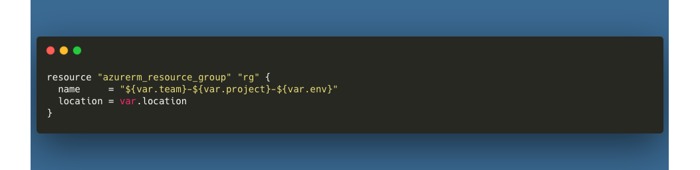
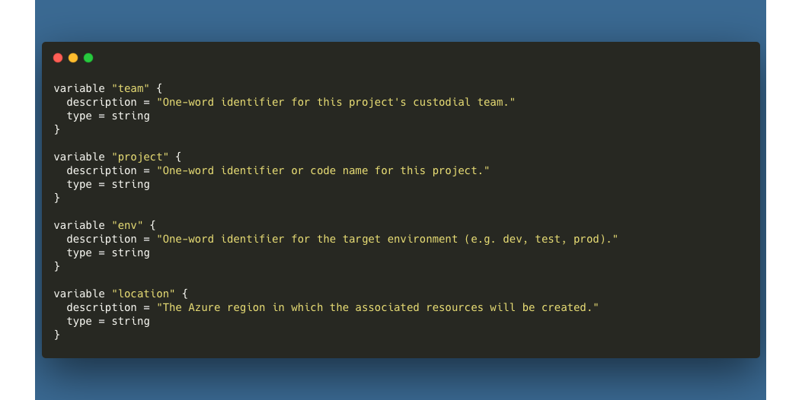

# Resource Groups
Resource groups are a fundamental way of sandboxing specific resources within Azure. They are used to manage and organize resources, and they provide a way to manage access control, billing, and compliance. Resource groups can contain resources such as virtual machines, storage accounts, virtual networks, web apps, databases, and more.

## File Structure
Resource group templates are located in the `templates/foundations` directory, as part of the foundational block of resources. The `main.tf` file contains the resource group resource definition. The `_vars.tf` file contains the input variables for the resource group resource. The `_output.tf` file contains the output variables for the resource group resource.

```
- templates
  - foundations
    - main.tf
    - _vars.tf
    - _output.tf
```

## Usage
Example usage of this module can be found in the `templates/implementation` directory. At a minimum, you will need to implement the following local and module declarations in your environment definition file:



## Variables
The following variables are required for this asset. They are already defined in the `_vars.tf` file within the `foundations` directory.

