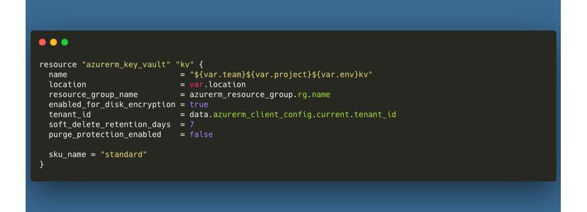

# Key Vault
Key Vaults are used to store and manage sensitive information such as passwords, certificates, and encryption keys. Key Vaults are designed to be secure and are protected by Azure's robust security measures.

## File Structure
Key Vault templates are located in the `templates/foundations` directory, as part of the foundational block of resources. The `main.tf` file contains the Key Vault resource definition. The `_vars.tf` file contains the input variables for the Key Vault resource. The `_output.tf` file contains the output variables for the Key Vault resource.

```
- templates
  - foundations
    - main.tf
    - _vars.tf
    - _output.tf
```

## Usage
Example usage of this module can be found in the `templates/implementation` directory. At a minimum, you will need to implement the following local and module declarations in your environment definition file:

