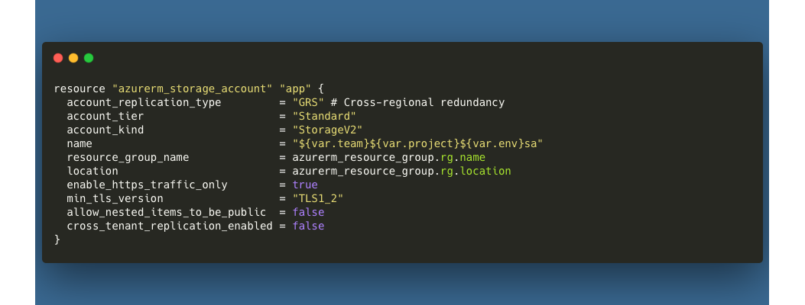

# Storage Accounts
Storage accounts are used to store and manage data in Azure. Storage accounts can be used to store files, blobs, tables, queues, and disks. Security and access are configurable on a per-resource basis, and can be easily adapted to fit your project's unique needs.

## File Structure
Storage account templates are located in the `templates/foundations` directory, as part of the foundational block of resources. The `main.tf` file contains the storage account resource definition. The `_vars.tf` file contains the input variables for the storage account resource. The `_output.tf` file contains the output variables for the storage account resource.

```
- templates
  - foundations
    - main.tf
    - _vars.tf
    - _output.tf
```

## Usage
Example usage of this module can be found in the `templates/implementation` directory. At a minimum, you will need to implement the following local and module declarations in your environment definition file:

