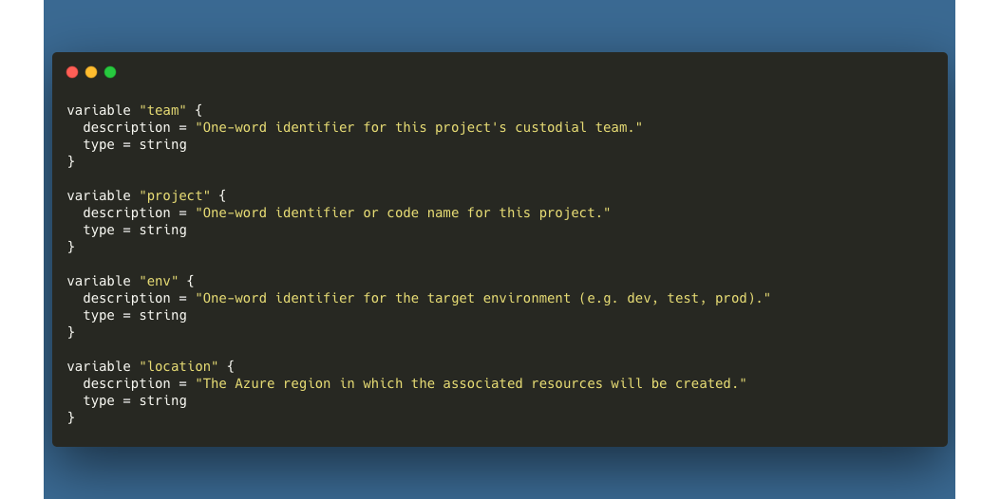

# Azure Container Registry
The Azure Container Registry is used to store and manage container images for use with Azure services.

## File Structure
Storage account templates are located in the `templates/foundations` directory, as part of the foundational block of resources. The `main.tf` file contains the storage account resource definition. The `_var.tf` file contains the input variables for the storage account resource. The `_output.tf` file contains the output variables for the storage account resource.

```
- templates
  - foundations
    - main.tf
    - _var.tf
    - _output.tf
```

## Usage
Example usage of this module can be found in the `templates/implementation` directory. At a minimum, you will need to implement the following local and module declarations in your environment definition file:


## Variables
The following variables are required for this asset. They are already defined in the `_var.tf` file within the `foundations` directory.

