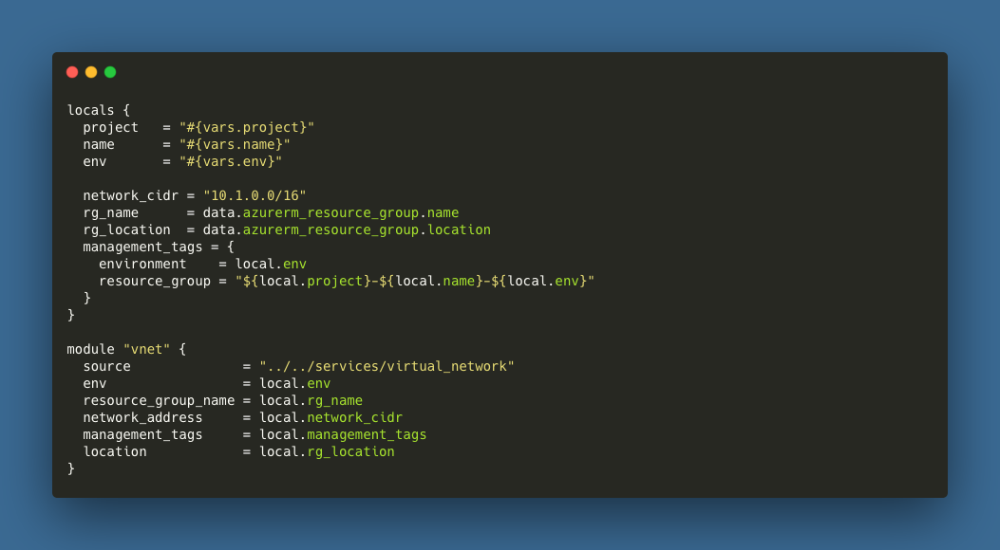
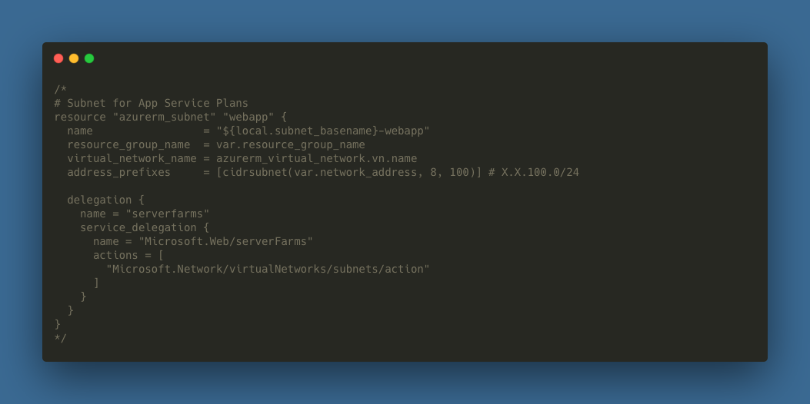

# Virtual Networks

Virtual Networks, or VNets, are the foundation of your network in Azure. VNETs allow you to securely connect Azure resources to each other, the internet, and on-premises networks. VNets are similar to traditional networks, but with additional benefits of Azure's infrastructure.

For security and resiliency, VNets are isolated from one another. This isolation prevents traffic from one VNet from directly communicating with another VNet. However, you can connect VNets together by using VNet peering, private endpoints, or other Azure resources.


## File Structure
VNet templates are located in the `templates/virtual_network` directory. The `main.tf` file contains the VNet and subnet resource definitions. The `_vars.tf` file contains the input variables for the VNet resource. The `_output.tf` file contains the output variables for the VNet resource.

```
- templates
  - virtual_network
    - main.tf
    - _vars.tf
    - _output.tf
```

## Usage
Example usage of this module can be found in the `templates/implementation` directory. At a minimum, you will need to implement the following local and module declarations in your environment definition file:



## Extras
This template has several commented sections that can be used to add additional subnets to the VNet as you introduce new infrastructure components. As an example, the following section creates a subnet for an Azure App Service Plan:



To use this resource in your code, simply uncomment the section. No variable updates should be needed. If you need multiple instances of the same resource, you can copy the section and update the subnet name and address space as needed.